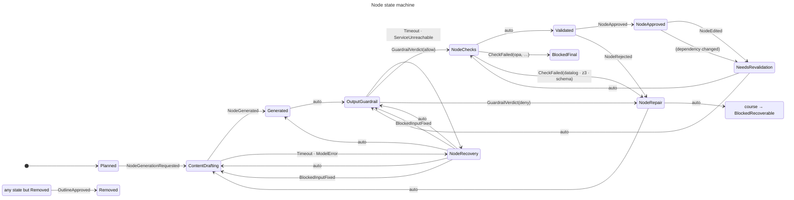

# State machines

Generated from the tables in `../transitions.html` by `export-model.py` on 2026-09-03.
Do not edit: change `../transitions.html` and re-run the exporter.

## Revision machine

```mermaid
---
title: Revision state machine
---
stateDiagram-v2
    direction LR
    state "any non-terminal draft state" as Xanynonterminaldraftstate
    state "any state in the live lineage" as Xanystateinthelivelineage
    state "rev n+1 · ContentInProgress (spawn)" as Xrevn1ContentInProgressspawn
    state "rev n+1 · ContentInProgress (spawn; this revision does not move)" as Xrevn1ContentInProgressspawnt
    state "the state after the operation" as Xthestateaftertheoperation
    state "the state that blocked" as Xthestatethatblocked
    state "the state that issued the operation" as Xthestatethatissuedtheoperati

    [*] --> AwaitingBrief

    AwaitingBrief --> BriefValidation : BriefSubmitted
    BriefValidation --> BlockedRecoverable : auto
    BriefValidation --> BlockedFinal : auto
    BriefValidation --> BlockedFinal : GuardrailVerdict(deny)
    BriefValidation --> BriefFeasibility : GuardrailVerdict(allow)
    BriefValidation --> ErrorRecovery : Timeout · ServiceUnreachable
    BriefFeasibility --> OutlineDrafting : auto
    BriefFeasibility --> BlockedRecoverable : auto
    ContentInProgress --> OutlineChecks : OutlineRevised
    BlockedRecoverable --> OutlineChecks : OutlineRevised
    BlockedRecoverable --> BriefValidation : BriefSubmitted
    BlockedRecoverable --> OutlineDrafting : BlockedInputFixed
    BlockedRecoverable --> Xthestatethatblocked : BlockedInputFixed
    OutlineDrafting --> OutlineGuardrail : OutlineGenerated
    OutlineDrafting --> ErrorRecovery : Timeout · ModelError
    OutlineGuardrail --> ErrorRecovery : Timeout · ServiceUnreachable
    OutlineGuardrail --> OutlineChecks : GuardrailVerdict(allow)
    OutlineGuardrail --> OutlineRepair : GuardrailVerdict(deny)
    OutlineChecks --> OutlineReview : auto
    OutlineChecks --> BlockedFinal : CheckFailed(opa, …)
    OutlineChecks --> OutlineRepair : CheckFailed(datalog · z3 · schema)
    OutlineRepair --> OutlineDrafting : auto
    OutlineRepair --> BlockedRecoverable : auto
    OutlineRepair --> BlockedRecoverable : auto
    OutlineReview --> OutlineDrafting : OutlineRejected
    OutlineReview --> ContentInProgress : OutlineRejected
    OutlineReview --> ContentInProgress : OutlineApproved
    ContentInProgress --> BlockedRecoverable : (node → BlockedFinal)
    ContentInProgress --> BlockedRecoverable : (node → NodeRecovery)
    ContentInProgress --> ReadyForReview : (node state changed)
    ReadyForReview --> ContentInProgress : NodeEdited(any)
    WholeCourseChecks --> ContentInProgress : NodeEdited(any)
    PendingApproval --> ContentInProgress : NodeEdited(any)
    Approved --> ContentInProgress : NodeEdited(any)
    ReadyForReview --> WholeCourseChecks : CourseChecksRequested
    WholeCourseChecks --> PendingApproval : auto
    WholeCourseChecks --> ContentInProgress : CheckFailed(layer, nodes)
    PendingApproval --> ContentInProgress : ApprovalRejected
    PendingApproval --> Approved : ApprovalGranted
    Approved --> ContentInProgress : ReturnedToWork
    Approved --> Published : PublishRequested
    Published --> Xrevn1ContentInProgressspawnt : ReviseRequested
    Published --> StaleReview : PolicyChanged · GuardrailChanged · CatalogChanged · KBUpdated
    Xanystateinthelivelineage --> Withdrawn : WithdrawRequested
    Published --> Superseded : LivePointerMoved
    Published --> Published : LearnersNotified
    StaleReview --> Published : auto
    StaleReview --> Withdrawn : auto
    StaleReview --> ErrorRecovery : Timeout · ServiceUnreachable
    StaleReview --> Withdrawn : WithdrawRequested
    Superseded --> StaleReview : RollbackRequested
    Superseded --> StaleReview : PolicyChanged · GuardrailChanged · CatalogChanged · KBUpdated
    Superseded --> Archived : ArchiveRequested
    Withdrawn --> Archived : ArchiveRequested
    Withdrawn --> Xrevn1ContentInProgressspawn : ReviseRequested
    Xanynonterminaldraftstate --> Archived : DraftDiscarded
    ErrorRecovery --> Xthestateaftertheoperation : auto
    ErrorRecovery --> Xthestatethatissuedtheoperati : auto
    ErrorRecovery --> BlockedRecoverable : auto
```



## Node machine



## Context

Hand-maintained in `context-diagram.mmd`; reproduced here so it renders.

```mermaid
---
title: Context — Governed AI Course Generator
---
%% artifact:     context-diagram
%% question:     Who is inside the boundary and who is outside?
%% owner:        system architect
%% updated_when: a component crosses the boundary, or a new external dependency appears
%% source:       specification.html §1, §4, §7; safety.html §8
%% authored:     2026-08-24
%%
%% Metadata lives in comments rather than the front matter: mermaid's front
%% matter accepts only its own keys, and an unknown one risks the render.
%% The boundary separates what we control from what we depend on. The model
%% provider sits OUTSIDE it and produces a proposal only; there is no path from
%% the model to course state that does not cross the generation gateway, which is
%% the single admission point and the only holder of platform credentials.
flowchart LR
  subgraph HUMANS["Human actors"]
    EDITOR["Course author / editor"]
    ADMIN["Training administrator"]
    COMPLIANCE["Compliance officer"]
  end

  subgraph CONFIG["Configuration — owned by people, not deployed"]
    THRESH["Thresholds and audience rules"]
  end

  subgraph EXTERNAL["External systems — depended on, not controlled"]
    CATALOG["Sylla platform — skills and block catalog"]
    KB["Sylla knowledge base"]
    PERMS["Sylla permission model"]
    GUARD["Managed guardrail service"]
    MODEL["Model provider"]
    LEARNERS["Learners"]
  end

  subgraph SYS["Governed AI Course Generator — system of interest"]
    ORCH["Orchestrator — revision and node state machines"]
    RET["Retrieval, scoped per topic"]
    SCHEMA["Schema validator"]
    OPA["Policy engine — OPA"]
    FORMAL["Formal layers — Z3, Datalog, Prolog, temporal logic"]
    GW["Generation gateway — sole admission authority"]
    STORE["State store"]
    AUDIT["Audit trace"]
    MON["Runtime monitor — PROPOSED, does not exist"]
    REPAIR["Repair loop — bounded retries"]
  end

  EDITOR -->|brief, edits, approvals| ORCH
  ADMIN -->|thresholds, audience rules| ORCH
  COMPLIANCE -->|guardrail policy, no deployment| GUARD

  ORCH -->|generate this node| GW
  ORCH --> RET
  RET --> KB
  RET --> CATALOG

  GW -->|prompt| MODEL
  MODEL -->|proposal only| SCHEMA
  SCHEMA --> GW
  GW --> OPA
  OPA --> PERMS
  GW --> GUARD
  GW --> FORMAL
  FORMAL --> CATALOG

  GW -->|admission| STORE
  STORE --> ORCH
  GW --> AUDIT
  GW -->|refusal| REPAIR
  REPAIR -->|bounded retry| GW
  AUDIT --> MON
  STORE --> MON
  MON -->|assumption violated| ORCH
  ADMIN --> THRESH
  THRESH --> GW
  ORCH -->|prepared, never performed| EDITOR
  EDITOR -->|publishes| LEARNERS
```
